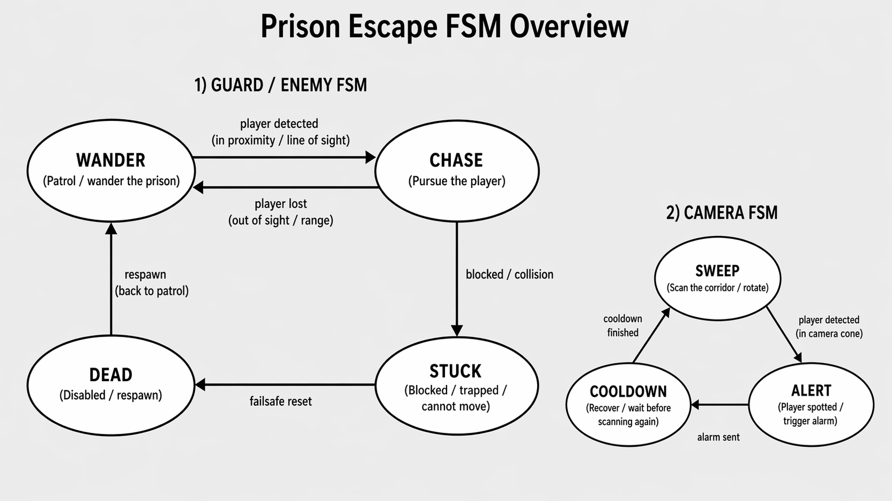

# Prison Escape FSM

Prison Escape FSM is a top-down browser stealth game built with HTML5 Canvas and vanilla JavaScript.
You play as a prisoner who can freely plan routes during the day and must escape at night while avoiding guards driven by independent finite state machines.

## Gameplay

- Explore the prison during the day.
- Learn patrol routes, hiding places, and the final escape path.
- Wait for night when the exit gate opens.
- Avoid guard vision, guard hearing, and group alerts.
- Reach the gate before losing all 3 lives.

## Controls

- **WASD / Arrow Keys** — move
- **Shift** — sneak more quietly
- **ESC** — pause / resume
- **M** — mute audio
- **R** — restart the current run

## Implemented JavaScript Events

The game includes more than the required minimum of 10 event types:

1. `load`
2. `resize`
3. `keydown`
4. `keyup`
5. `click`
6. `mousemove`
7. `mousedown`
8. `mouseup`
9. `contextmenu`
10. `wheel`
11. `focus`
12. `blur`
13. `visibilitychange`
14. `requestAnimationFrame`
15. `setInterval`
16. custom events: `gameStart`, `gameOver`, `gameWin`, `dayStart`, `nightStart`, `guardAlert`

## FSM Design

Each guard runs its own reusable `StateMachine` instance.
There are **5 guards**, and each uses the following **5 states**:

- `PATROL`
- `SUSPICIOUS`
- `SEARCH`
- `CHASE`
- `RETURN`

### State Diagram



### Transition Table

| Current State | Input / Condition | Next State | Action |
|---|---|---|---|
| PATROL | Hears movement or detects close noise | SUSPICIOUS | Move to investigate |
| PATROL | Clearly sees player | CHASE | Alert nearby guards and pursue |
| SUSPICIOUS | Clearly sees player | CHASE | Start direct pursuit |
| SUSPICIOUS | Reaches clue without confirmation | SEARCH | Move to last known position |
| SUSPICIOUS | Player hides before full confirmation | RETURN | Resume route |
| SEARCH | Sees player again | CHASE | Reacquire target |
| SEARCH | Search timeout expires | RETURN | Give up and return |
| CHASE | Loses visual contact | SEARCH | Continue around last known position |
| CHASE | Player hides after detection | CHASE / SEARCH | Pressure hiding spot, then search |
| RETURN | Arrives back at route | PATROL | Resume patrol |
| RETURN | Sees player on the way back | CHASE | Re-enter pursuit |

## Features

- Full-screen responsive canvas layout inside a professional UI shell
- Main menu, pause menu, and polished end screen
- Day / night cycle affecting gameplay rules
- Prison cell rules and one-way night lockout
- Hiding spots with doorway logic
- Guard sight cones, hearing checks, alert propagation, and chase pressure
- HUD with lives, phase, timer bar, minimap, and objective hints
- Sound effects and ambient background audio with mute toggle
- Custom hand-made sprites and generated sound assets included locally

## Folder Structure

```text
/game
  /assets
    /images
    /sounds
  /css
    style.css
  /js
    main.js
    player.js
    enemy.js
    fsm.js
  index.html
  README.md
  fsm-diagram.png
```

## How to Run

1. Open `index.html` directly in a browser, or
2. Use a local server such as VS Code Live Server for best audio behavior.

## Technologies Used

- HTML5 Canvas
- Vanilla JavaScript (ES6 classes, `const` / `let`, custom events)
- CSS3

## Notes for Submission

- All code and comments are in English.
- The guard AI uses a reusable FSM class.
- The project includes documentation, state diagram, transition table, menu screens, sound, and polish assets.
